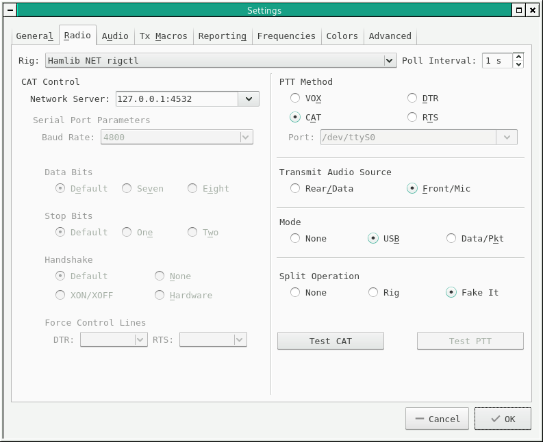
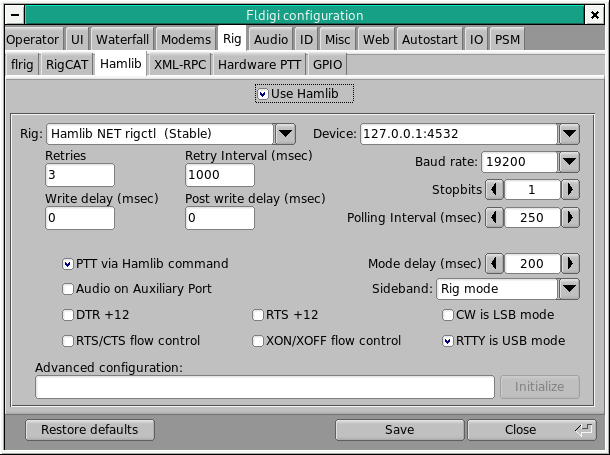

# X5105 RIGCTLD

## 中文说明

我有一台协谷的X5105，接在计算机上使用。平时用的是Windows，可以用OmniRig或Ham Radio Deluxe连接电台，其他的业余电台软件选择这二者之一来控制电台，就可以很完美的工作。

但在Linux上，就比较尴尬了。Linux上的大部分业余电台软件都通过hamlib来操控电台。虽然X5105实现了ICOM的CIV协议（和IC-7000非常接近），但由于细节上的差异，hamlib和X5105之间有些不兼容，会造成业余电台软件不可用。例如Fldigi、WSJT-X等软件在Linux上工作不正常。

为了能在Linux上使用X5105，特别是在外出架台时通过树莓派来操控它，我尝试按照hamlib的网络控制接口来实现X5105的操控，让所有用hamlib的业余电台软件能与之正常工作。经过一天的努力，达成了这个目标:)

hamlib的网络控制接口资料在其[官方项目的wiki](https://github.com/Hamlib/Hamlib/wiki/Network-Device-Control)中。

### 控制逻辑示意图

```
[业余电台软件] <---> [hamlib] <- tcp连接 -> [x5105-rigctld] <- 串口连接 -> [x5105电台]
```

### 配置

按照控制逻辑示意图，有两个地方需要进行配置：

- x5105-rigctld（本程序）配置：
  - 它如何向hamlib提供tcp连接的服务（服务绑定的主机和端口号）
  - 它如何连接x5105（串口文件路径、波特率和通讯超时设置）
  - 其他（日志输出的级别）
- hamlib配置：hamlib到x5105-rigctld之间的连接。这通常在业余电台软件的电台设置中可找到。配置包括：
  - hamlib的电台类型：需选择“Hamlib Net rigctl”
  - 网络服务器：需要与x5105-rigctld的配置相符，例如“127.0.0.1:4532”

x5105-rigctld的配置文件路径为`$HOME/.config/x5105/config`。如果此文件不存在，或者文件中的配置项不全，本程序对于找不到的配置项会使用默认值。

下面是配置文件内容的范例，配置项的取值都是默认值：
```ini
[rig]
file=/dev/ttyUSB0
baudrate=19200
timeout=1

[daemon]
host=127.0.0.1
port=4532

[logging]
level=INFO
```

下面给出部分业余电台软件中配置hamlib的截图，作为示范。其他的软件可以用类似的方式进行配置：

WSJT-X：



Fldigi：



### 安装和运行x5105-rigctld

为了尽可能方便使用，本程序全部代码都在一个文件`main.py`中。将这个文件复制到任何地方，安装了python3和python3-serial，即可运行。

```bash
# 首先确保系统中已经安装好python3和python3-serial
# 然后运行main.py
./main.py
# 或者用另一种写法
python3 main.py
```

### 一些限制和不足

- 本程序没有做串口通讯的并发控制，因此为了避免出错，在网络通讯部分做了限制，只接受一个网络连接。因此，无法让多个应用程序同时操作一台X5105。
- 由于编写和调试代码的时间还很短（不到24个小时），因此当前（2018年11月17日）的代码应该还有很多不完善的地方，一定会有bug，需要逐步完善。也希望大家能提供PR，谢谢了先！

目前这个程序可以和fldigi、wsjt-x协作运行，其他的业余电台软件还没试用。在树莓派的raspbian操作系统和笔记本电脑的archlinux操作系统上运行良好。